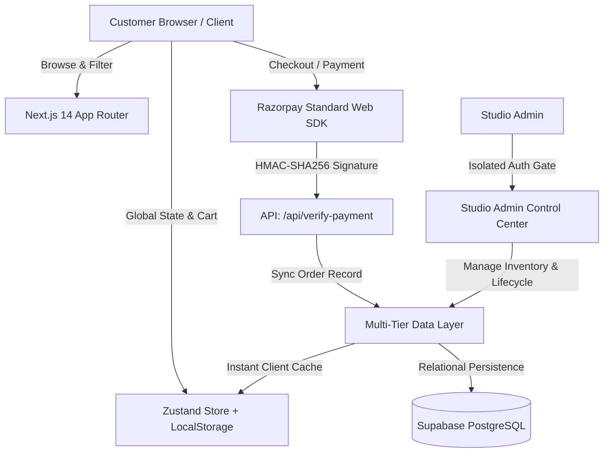

<div align="center">

# 🌸 Loops of Love — Artisanal Crochet D2C Platform
### *Handcrafted Keepsakes Built to Last Forever*

[](https://nextjs.org/)
[](https://www.typescriptlang.org/)
[](https://tailwindcss.com/)
[](https://supabase.com/)
[](https://razorpay.com/)
[](LICENSE)

<p align="center">
  A production-ready, full-stack D2C e-commerce platform built for <strong>Loops of Love</strong> — an Indian boutique studio specializing in premium handmade crochet floral bouquets, amigurumi plushies, car mirror charms, and personalized festive decor.
</p>

[Explore Storefront](#-key-features) • [System Architecture](#-architectural-highlights) • [Getting Started](#-getting-started) • [Admin Control Center](#-studio-admin-control-center)

---

</div>

## 📖 Executive Summary & Brand Philosophy

**Loops of Love** is a celebration of mindful craftsmanship. In a fast-fashion world of disposable gifts, our artisans craft everlasting floral bouquets, cozy keepsake toys, and aesthetic lifestyle accessories with 100% hypoallergenic cotton and plush chenille yarn.

This platform bridges the warm, human touch of handmade Indian craftsmanship with high-performance modern web engineering:
- **Zero-Flicker Performance:** Optimized Server Components and instant client hydration.
- **Trust-Driven Commerce:** Cryptographically verified payments, multi-stage package tracking, and authenticated customer gates.
- **Bespoke Commissions:** Dedicated interactive workflows for made-to-order custom creations.

---

## 🏗️ Architectural Highlights

Designed and built with modern software engineering principles, the codebase emphasizes separation of concerns, defensive programming, and seamless user experiences.



### 1. Multi-Tier Resilient Data Layer (`src/lib/data-service.ts`)
- **Tri-Layer Synchronization:** Transparently merges browser local persistence, Supabase relational tables, and in-memory caches.
- **Reactive Event Bus:** Utilizes custom browser event dispatchers (`order-created`, `auth-change`) to synchronize data across tabs and components with zero network latency.

### 2. Cryptographic Payment Verification (`src/lib/razorpay.ts`)
- Implements standard server-side Razorpay signature verification using **HMAC SHA-256** digests to prevent tampering.
- Dual payment route support: **Online Razorpay Gateway (UPI, Cards, NetBanking)** and **Cash on Delivery (COD)** with instant order confirmation.

### 3. Strict Boundary Isolation
- **Customer Experience:** Smooth micro-interactions, responsive navigation, sticky header with backdrop blur, and cart drawers.
- **Admin Isolation:** Completely removes shopping elements (cart drawers, wishlist badges, customer navigation) when navigating inside `/admin/*` routes.

---

## 🛍️ Key Platform Features

### 🌸 Customer Storefront
- **Interactive Shop Engine:** Filter by category pills with live inventory counts, interactive price range slider (₹200 – ₹3,000), search bar with instant clear, and Grid vs. List view toggle.
- **Dynamic Product Pages:** High-resolution image gallery switcher, PIN code courier estimator with arrival date calculations, verified customer reviews system, and related creation carousels.
- **Interactive Slide-Out Cart:** Real-time Free Shipping progress meter (Threshold: ₹999), instant coupon code applicator (`LOVE10`), and gift note support.

### 🔒 Authenticated Customer Experience
- **Mandatory Auth Guards:** Unauthenticated visitors are gently guided through a dedicated sign-in gate before adding items to cart, saving wishlists, requesting custom pieces, or checking out.
- **Live Package Tracking (`/track-order`):** Visual 4-stage lifecycle stepper:
  $$\text{1. Order Received} \longrightarrow \text{2. Artisan Crafting} \longrightarrow \text{3. Courier Dispatched} \longrightarrow \text{4. Delivered}$$
- **Customer Dashboard (`/account`):** View all placed orders, one-click Order ID copy (`📋`), delivery details, and direct tracking buttons.

### 🎨 Made-to-Order Custom Portal (`/custom-order`)
- Direct custom piece inquiry portal allowing customers to specify custom color palettes, flower counts, plushie characters, target budgets, and Pinterest/Instagram reference links.

### 👑 Studio Admin Control Center (`/admin`)
- **Studio Overview:** Live financial metrics (Total Paid Revenue, Order counts across all 4 fulfillment stages, Catalog statistics).
- **Orders & Fulfillment (`/admin/orders`):** Search orders by ID, Customer Name, Email, or City. Update lifecycle progress in real time with live customer sync.
- **Products & Stock (`/admin/products`):** Real-time inventory tracking and product management.
- **Custom Inquiries (`/admin/custom-orders`):** Review incoming made-to-order inquiries with direct one-click WhatsApp client contact buttons.
- **Promotions & Coupons (`/admin/coupons`):** Create and manage discount codes, percentage vs. fixed price reductions, and usage limits.

---

## 📂 Project Directory Structure

```text
LoopsOfLove/
├── .env.example                     # Environment configuration template
├── .gitignore                       # Git ignore specifications
├── LICENSE                          # MIT Open Source License
├── README.md                        # Enterprise project documentation
├── next.config.mjs                  # Next.js build and optimization config
├── package.json                     # Project manifest and dependencies
├── postcss.config.js                # PostCSS Tailwind processor
├── tailwind.config.ts               # Custom brand palette and font tokens
├── tsconfig.json                    # Strict TypeScript compiler configuration
│
├── scripts/
│   └── migrate_and_seed.js          # Database schema migration utility
│
├── supabase/
│   └── migrations/                  # Versioned SQL migrations (PostgreSQL DDL)
│
└── src/
    ├── app/                         # Next.js 14 App Router (32 Production Routes)
    │   ├── layout.tsx               # Root Server Component Layout
    │   ├── globals.css              # Custom font rules, keyframes, and utilities
    │   ├── page.tsx                 # D2C Storefront Homepage
    │   ├── shop/                    # Product catalog with dynamic filters
    │   ├── products/[slug]/         # Product detail page with reviews & estimator
    │   ├── cart/                    # Shopping cart summary page
    │   ├── checkout/                # Razorpay & COD checkout with auth gates
    │   ├── order-confirmation/[id]/ # Order success page with copyable Order ID
    │   ├── track-order/             # 4-stage live order tracking portal
    │   ├── custom-order/            # Made-to-order custom inquiry portal
    │   ├── account/                 # Customer dashboard & order history
    │   ├── login/ & signup/         # Customer authentication gateways
    │   ├── admin/                   # Studio Admin Control Center
    │   └── api/                     # Backend API handlers (create-order, verify)
    │
    ├── components/                  # Modular Component Architecture
    │   ├── admin/                   # AdminHeader navigation bar
    │   ├── cart/                    # Slide-out Cart Drawer with Free Shipping meter
    │   ├── home/                    # Hero, CategoryGrid, FeaturedSection, Story, Trust
    │   ├── layout/                  # Header, Footer, AnnouncementBar, MobileNav, ClientProviders
    │   ├── product/                 # ProductCard, Gallery, QuickViewModal
    │   └── ui/                      # Buttons, Badges, Toast notifications
    │
    ├── data/
    │   └── sample-data.ts           # Handcrafted catalog products and default store settings
    │
    ├── lib/
    │   ├── data-service.ts          # Unified resilient multi-layer data abstraction
    │   ├── razorpay.ts              # Razorpay SDK initialization & signature validation
    │   ├── store.ts                 # Zustand global client state management
    │   ├── supabase.ts              # Supabase client & authentication helpers
    │   └── utils.ts                 # Currency formatter (₹), date helpers, validation
    │
    └── types/
        └── index.ts                 # Strict TypeScript domain interfaces
```

---

## 🛠️ Technology Stack

| Layer | Technology | Purpose |
|---|---|---|
| **Core Framework** | Next.js 14 (App Router) | High-performance React framework with Server Components |
| **Language** | TypeScript 5.0 | End-to-end type safety across domain models and APIs |
| **Styling & Design** | Tailwind CSS | Design tokens, warm artisan color palette, and micro-animations |
| **State Management** | Zustand | Lightweight, decoupled global client state with persistence |
| **Database & Auth** | Supabase (PostgreSQL) | Managed database, relational integrity, and user authentication |
| **Payment Gateway** | Razorpay Web Checkout | Standard Indian payment gateway supporting UPI, Cards, NetBanking |
| **Icons & Media** | Lucide React | Clean, modern feather-style iconography |

---

## 🚀 Getting Started

### 1. Prerequisites
- **Node.js:** `v18.17.0` or higher
- **Package Manager:** `npm` or `yarn` / `pnpm`

### 2. Clone the Repository
```bash
git clone https://github.com/<YOUR_USERNAME>/LoopsOfLove.git
cd LoopsOfLove
```

### 3. Install Dependencies
```bash
npm install
```

### 4. Configure Environment Variables
Create a `.env.local` file in the root directory and configure the required credentials:
```env
# Razorpay Payment Gateway
NEXT_PUBLIC_RAZORPAY_KEY_ID=rzp_test_xxxxxxxxxxxxxx
RAZORPAY_KEY_ID=rzp_test_xxxxxxxxxxxxxx
RAZORPAY_KEY_SECRET=xxxxxxxxxxxxxxxxxxxxxxxx

# Supabase Database & Auth
NEXT_PUBLIC_SUPABASE_URL=https://xxxxxxxxxxxx.supabase.co
NEXT_PUBLIC_SUPABASE_ANON_KEY=xxxxxxxxxxxxxxxxxxxxxxxxxxxxxxxx
```

### 5. Start Development Server
```bash
npm run dev
```
Navigate to [http://localhost:3000](http://localhost:3000) to view the live storefront.

---

## 📜 Available NPM Scripts

| Script | Command | Description |
|---|---|---|
| `dev` | `next dev` | Launches the Next.js development server on port 3000 |
| `build` | `next build` | Creates an optimized production build with static generation |
| `start` | `next start` | Runs the built application in production mode |
| `typecheck` | `tsc --noEmit` | Runs the TypeScript compiler to verify 0 type errors |
| `lint` | `next lint` | Executes ESLint rules across the codebase |

---

## 🔐 Security & Engineering Standards

- **Server Component Integrity:** Root layout maintains Server Component architecture for instant CSS injection and SEO metadata rendering.
- **HMAC Signature Validation:** All payment callbacks are cryptographically verified against the Razorpay webhook secret before marking orders as paid.
- **Zero Mock Data in Production:** Built with graceful fallbacks and genuine database records for customer orders and custom commissions.
- **Sanitized Inputs:** All customer inputs across checkout and custom orders are sanitized and validated against standard Indian PIN codes and 10-digit mobile formats.

---

## 📄 License & Attribution

Distributed under the **MIT License**. See [`LICENSE`](LICENSE) for complete details.

Crafted with ❤️ for **Loops of Love Studio**.
